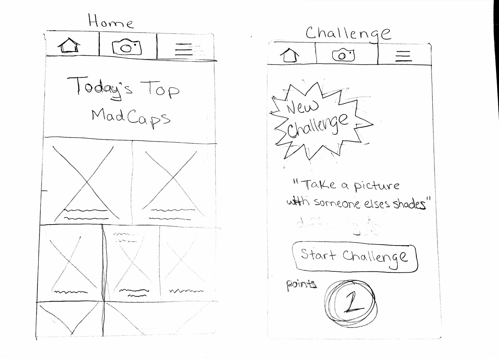
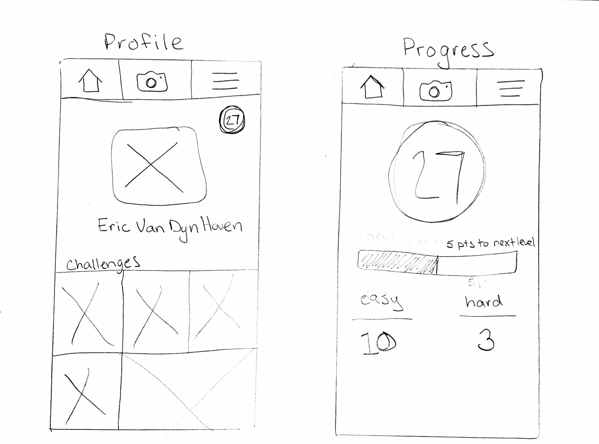

## MadCap
MadCap is an exciting new picture challenge app that pits you against your friends to see you can take the craziest photos based on a given scenario. Each day you will receive a daily challenge which will ask you to take a selfie in a unusual way. For Example, you could be asked to:

"Take a selfie with a non-domestic animal" 

"Take a selfie with a Fast Food Employee"

There is only one rule. You must be in the picture you take. The goal of the app is to bring you outside your comfort zone in a fun and unique way that you can look back at for years to come. You also you receive points for completing each challenge that raised your MadCap level. Be the best MadCap in your area and your challenge photo will be displayed for all fellow MadCappers to look up to. So be creative and have fun. The only limitation is your own imagination.

### Features

- Use your own phone to submit picture on the go.
- Get enough likes and your pic will be displayed as a top challenge photo of the day.
- Rack up points to become a leader on your local MadCap leaderboard.
- Share challenges on all of your favorite social media.

## Deploy Instructions

Backend Setup - [Link to repo](https://github.com/evandynh/madcap-backend)
```
  Step 1: Clone the backend repository from GitHub.

  Step 2: npm install.

  Step 3: run nodemon.
  
  Step 4: run mongod. 
  
  Step 5: Visit localhost:3000 in the web browser
```

Frontend Setup - [Link to repo](https://github.com/evandynh/madcap-frontend)
```
  Step 1: Clone the frontend repository from Github
  
  Step 2: Run ionic serve -l in the terminal

```


[TRELLO:  User Stories](https://trello.com/b/piXaTwuQ/madcap)

## ERD & Wireframes





## Approach
 I will begin by refreashing myself on our ionic markdowns as well as watch videos for MVP features. I will then focus on setting up a basic app while testing it out on a server. I plan to make the app accessible for both iOS and Andriod so I look forward to comparing them side by side as I develop the project
<br>
<br>
Most of my attention for the first couple of days will be setting up a backend that can handle all of the photos coming in as well as figuring out how to use the clients built in camera for the app. i have used AWS S3 buckets for my second project and I'm hoping that experience helps me through storage problems. 
<br>
<br>
Lastly, I need to focus setting up the user experience for challenges and notifications if possible. I'd like to update a challenge each day and send notifications to all users that a new challenge is available. I also want to style it in a way were you can look back at past challenges.

## MVP
- User can sign into their profile and see their pictures.
- User can see the daily challenge and post a new picture.
- User can see other user daily challenge pictures.
- User can use there own camera for the picture or take a photo from there local storage.


## Stretch Goals
- User can like other user's pictures
- User can get points for consecutive challenges beaten.
- User can geo-locate there pictures based on there current location.
- User can search for pictures by location.
- User can recieve points for a certain number of likes and be placed on a leaderboard.
- Leaderboard is based on location / city.
- Add filters to your pictures to give them swag.
- User can choose a challenge difficulty each day based on their confidence.
- User's can share there pictures with facebook and instagram.


## Technologies Used
```
 Ionic
 Cordova
 NodeJS
 AngularJS
 MongoDB
 HTML5 / CSS3
```

## Unsolved Problems
- User can sign in but there pictures do not save to there user profile.
- Challenge page does not refresh once a challenge is completed.
- Like buttons are extremely slow to update on home tab
- Cannot inject auth factory in all factories
